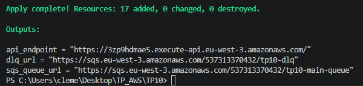
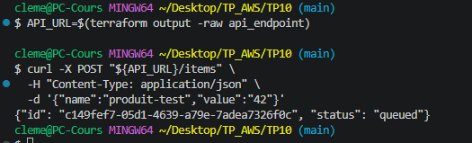
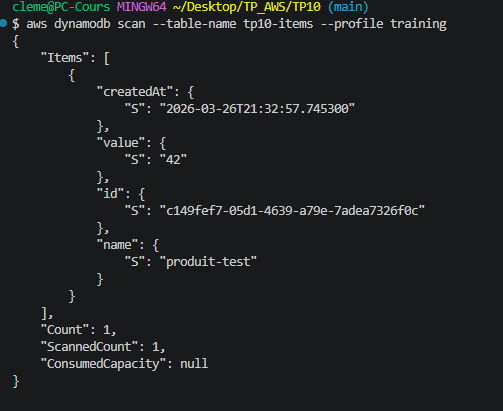
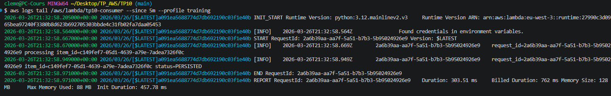
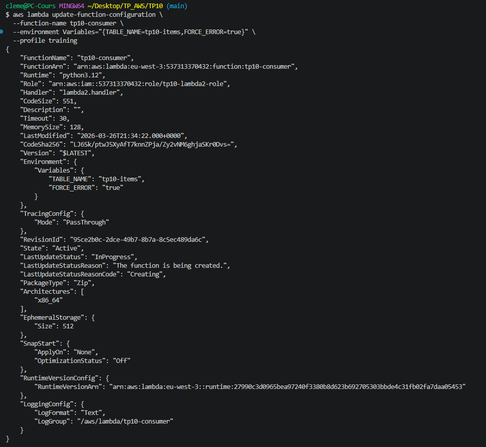
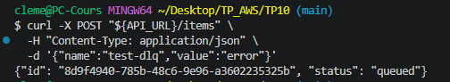
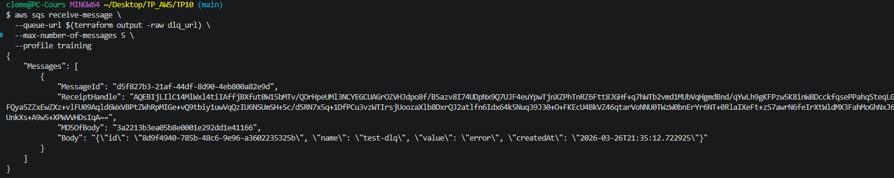
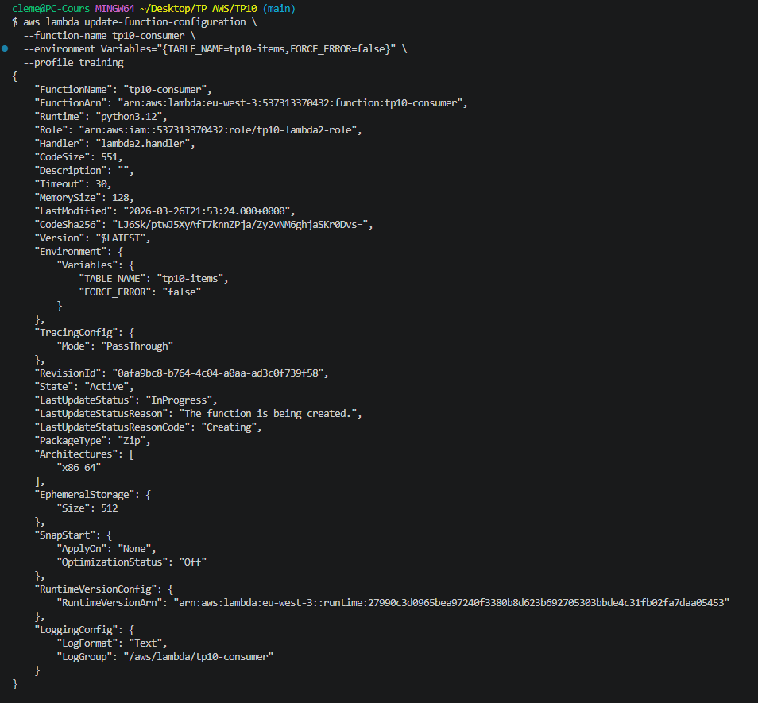

# TP 10 : API Gateway + SQS + DLQ — Pipeline asynchrone
 
## Objectif
 
Construire un pipeline de traitement asynchrone découplé :
`POST /items` → Lambda producer → SQS → Lambda consumer → DynamoDB.
Démontrer la résilience du pipeline via la Dead Letter Queue (DLQ) en simulant des erreurs répétées.
 
## Infrastructure as Code — Terraform
 
Ce TP a été entièrement réalisé avec **Terraform**. L'ensemble des fichiers sont disponibles dans ce dépôt.
 
### Structure des fichiers
 
| Fichier | Rôle |
|---|---|
| `versions.tf` | Déclaration du provider AWS, région lue depuis le state de `base/` |
| `main.tf` | DynamoDB, SQS, DLQ, rôles IAM, Lambdas, API Gateway |
| `outputs.tf` | Outputs : URL de l'API, URL de la queue et de la DLQ |
| `lambda1.py` | Lambda producer — validation et envoi vers SQS |
| `lambda2.py` | Lambda consumer — lecture SQS et persistence DynamoDB |
 
> **Note :** Aucune donnée sensible — pas de `variables.tf` ni `terraform.tfvars` pour ce TP.
 
## Architecture du pipeline
 
```
Client HTTP
    │
    │ POST /items
    ▼
API Gateway HTTP
    │
    │ invoke
    ▼
Lambda producer (tp10-producer)
    │  - Valide le payload (champs name et value requis)
    │  - Génère un UUID
    │  - Envoie le message dans SQS
    ▼
SQS Queue (tp10-main-queue)
    │  - Redrive vers DLQ après 3 tentatives échouées
    │
    │ event source mapping
    ▼
Lambda consumer (tp10-consumer)
    │  - Lit le message
    │  - Persiste l'item dans DynamoDB
    ▼
DynamoDB (tp10-items)
 
    En cas d'erreur répétée (× 3) :
    └──► DLQ (tp10-dlq)
```
 
## Ressources créées
 
### 1. DynamoDB (`tp10-items`)
- Mode **PAY_PER_REQUEST** — pas de coût fixe
- Clé de partition : `id` (UUID généré par le producer)
- Destination finale des messages traités avec succès
 
### 2. SQS Queue principale (`tp10-main-queue`)
- `visibility_timeout = 60s` — aligné sur le timeout de la Lambda consumer
- **Redrive policy** : renvoie vers la DLQ après **3 tentatives échouées** (`maxReceiveCount = 3`)
 
### 3. Dead Letter Queue (`tp10-dlq`)
- Capture les messages que le consumer n'a pas pu traiter après 3 tentatives
- Rétention : 1 jour
- Permet l'analyse post-mortem sans perte de message
 
### 4. Lambda producer (`tp10-producer`)
- Déclenchée par API Gateway sur `POST /items`
- Valide la présence des champs `name` et `value` — retourne HTTP 400 si invalide
- Génère un UUID et un timestamp, envoie dans SQS — retourne HTTP 202 `queued`
- Rôle IAM minimal : `sqs:SendMessage` sur la queue principale uniquement
 
### 5. Lambda consumer (`tp10-consumer`)
- Déclenchée par event source mapping SQS (`batch_size = 1`)
- Persiste le message dans DynamoDB
- Variable d'environnement `FORCE_ERROR` — permet de simuler des erreurs pour tester la DLQ sans modifier le code
- Rôle IAM minimal : `sqs:ReceiveMessage/DeleteMessage`, `dynamodb:PutItem`
 
### 6. API Gateway HTTP (`tp10-api`)
- Route : `POST /items` → intégration `AWS_PROXY` vers Lambda producer
- Stage `$default` avec auto-deploy activé
- URL exposée en output Terraform
 
## Déploiement
 
Après `terraform apply`, les 3 endpoints sont disponibles directement en output :
 

 
## Tests de validation
 
### Cas nominal — message traité avec succès
 
Récupération de l'URL de l'API depuis l'output Terraform et envoi d'un message :
 
```bash
API_URL=$(terraform output -raw api_endpoint)
curl -X POST "${API_URL}/items" \
  -H "Content-Type: application/json" \
  -d '{"name":"produit-test","value":"42"}'
```
 
La réponse HTTP 202 confirme que le message est accepté et mis en queue :
 

 
Vérification dans DynamoDB — l'item est bien persisté par le consumer :
 

 
Logs CloudWatch du consumer — cycle complet `processing` → `status=PERSISTED` :
 
```bash
MSYS_NO_PATHCONV=1 aws logs tail /aws/lambda/tp10-consumer \
  --since 5m --profile training
```
 

 
### Test de la DLQ — simulation d'erreurs répétées
 
**Étape 1 — activer `FORCE_ERROR=true` sur la Lambda consumer :**
 
```bash
aws lambda update-function-configuration \
  --function-name tp10-consumer \
  --environment Variables="{TABLE_NAME=tp10-items,FORCE_ERROR=true}" \
  --profile training
```
 

 
**Étape 2 — envoyer un message qui va échouer :**
 
```bash
curl -X POST "${API_URL}/items" \
  -H "Content-Type: application/json" \
  -d '{"name":"test-dlq","value":"error"}'
```
 

 
**Étape 3 — après ~3 minutes**, SQS a tenté 3 fois sans succès et redirigé le message vers la DLQ :
 
```bash
aws sqs receive-message \
  --queue-url $(terraform output -raw dlq_url) \
  --max-number-of-messages 5 \
  --profile training
```
 
Le message est bien présent dans la DLQ avec son contenu d'origine (`name: test-dlq`) :
 

 
**Étape 4 — rétablir le flux normal :**
 
```bash
aws lambda update-function-configuration \
  --function-name tp10-consumer \
  --environment Variables="{TABLE_NAME=tp10-items,FORCE_ERROR=false}" \
  --profile training
```
 

 
## Contrôles sécurité appliqués
 
- Rôles IAM **strictement minimaux** : chaque Lambda n'a accès qu'aux ressources dont elle a besoin
- Le producer ne peut qu'**envoyer** dans SQS — il ne peut ni lire ni supprimer
- Le consumer ne peut qu'**écrire** dans DynamoDB — aucun accès en lecture ou suppression
- L'API Gateway est publique mais la validation du payload est faite côté Lambda
- Aucune donnée sensible dans les variables d'environnement
- Tags obligatoires appliqués sur toutes les ressources (`Project`, `Owner`, `Env`, `CostCenter`)
 
## Teardown
 
```bash
terraform destroy -auto-approve
```