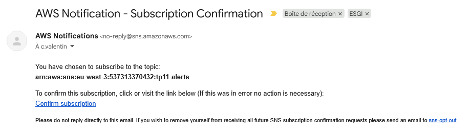
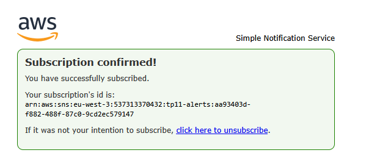
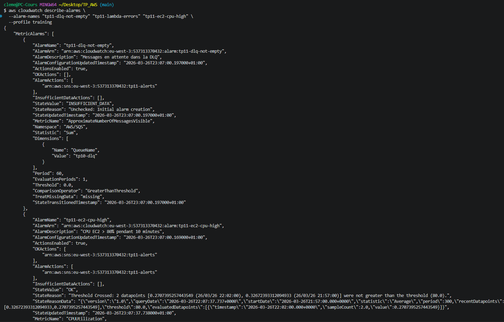
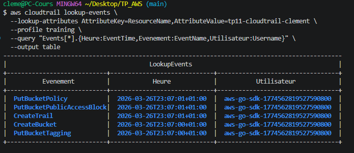
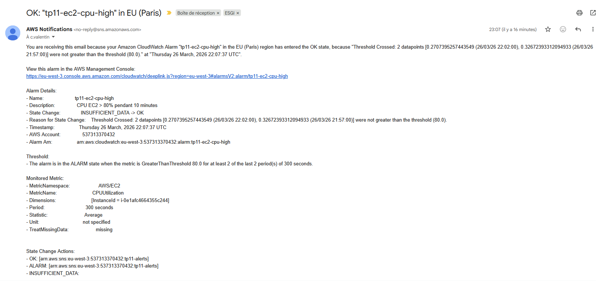
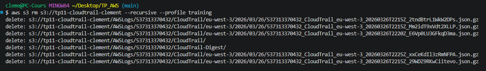
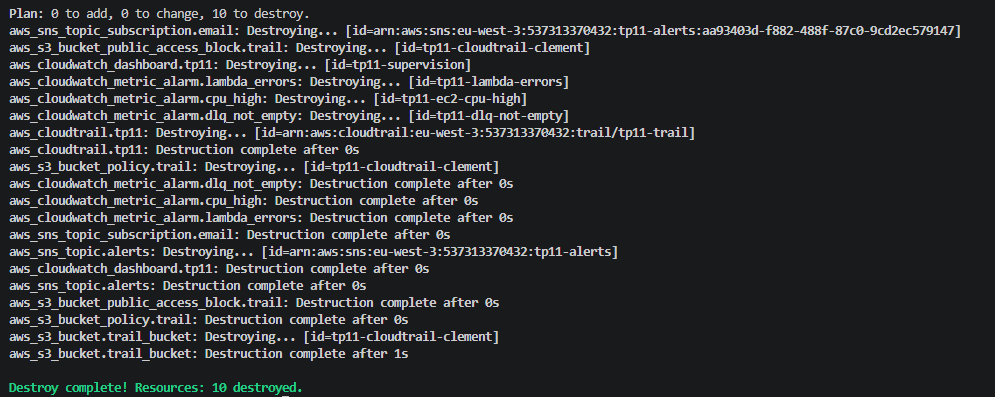

# TP 11 : Observabilité — CloudWatch Dashboard, Alarmes, CloudTrail
 
## Objectif
 
Mettre en place la supervision complète de l'infrastructure avec un dashboard centralisé, des alarmes actionnables reliées à des notifications email, et un trail CloudTrail pour l'audit des actions.
Produire un mini-runbook de réponse à incident.
 
## Infrastructure as Code — Terraform
 
Ce TP a été entièrement réalisé avec **Terraform**. L'ensemble des fichiers sont disponibles dans ce dépôt.
 
### Structure des fichiers
 
| Fichier | Rôle |
|---|---|
| `versions.tf` | Déclaration du provider AWS, région lue depuis le state de `base/` |
| `variables.tf` | Variable `alert_email` pour l'adresse de notification SNS |
| `terraform.tfvars` | Valeur de l'email (non versionné — voir `.gitignore`) |
| `main.tf` | Dashboard, SNS, alarmes, bucket CloudTrail, trail |
| `outputs.tf` | Output de l'ARN du topic SNS et du nom du trail |
 
## Ressources créées
 
### 1. Dashboard CloudWatch (`tp11-supervision`)
Dashboard centralisé exposant les métriques clés de l'infrastructure en un seul écran :
 
| Widget | Métrique | Source |
|---|---|---|
| CPU Utilization | `AWS/EC2 – CPUUtilization` | Instance EC2 de `base/` |
| Messages SQS visibles | `AWS/SQS – ApproximateNumberOfMessagesVisible` | Queue principale + DLQ TP10 |
| Erreurs Lambda | `AWS/Lambda – Errors` | `tp10-consumer` + `tp10-producer` |
| Durée Lambda | `AWS/Lambda – Duration` | `tp10-consumer` |
 
### 2. Topic SNS (`tp11-alerts`) + abonnement email
- Toutes les alarmes envoient leurs notifications vers ce topic
- Abonnement email confirmé manuellement après réception du mail AWS
 
### 3. Alarmes CloudWatch
 
| Alarme | Métrique surveillée | Seuil | Action |
|---|---|---|---|
| `tp11-ec2-cpu-high` | CPU EC2 | > 80% pendant 10 min | SNS + OK action |
| `tp11-dlq-not-empty` | Messages visibles DLQ | > 0 | SNS |
| `tp11-lambda-errors` | Erreurs `tp10-consumer` | > 0 | SNS |
 
### 4. CloudTrail (`tp11-trail`)
- Trail régional stocké dans un bucket S3 dédié (`tp11-cloudtrail-clement`)
- Validation de l'intégrité des logs activée (`enable_log_file_validation = true`)
- Bucket policy restreinte : seul CloudTrail peut écrire, uniquement dans le préfixe `AWSLogs/<account_id>/`
- Capture tous les appels d'API AWS dans la région `eu-west-3`
 
## Tests de validation
 
### Abonnement SNS — confirmation email
 
Après `terraform apply`, AWS envoie automatiquement un email de confirmation à l'adresse configurée.
L'abonnement doit être confirmé manuellement en cliquant le lien :
 

 

 
### Vérification des 3 alarmes
 
```bash
aws cloudwatch describe-alarms \
  --alarm-names "tp11-dlq-not-empty" "tp11-lambda-errors" "tp11-ec2-cpu-high" \
  --profile training
```
 
Les 3 alarmes sont actives, configurées sur le topic SNS `tp11-alerts` et en état `INSUFFICIENT_DATA` / `OK` selon la disponibilité des métriques :
 

 
> **Note :** L'état `INSUFFICIENT_DATA` sur `tp11-dlq-not-empty` est normal — il indique qu'aucune donnée de métrique SQS n'est encore disponible pour cette période d'évaluation. L'alarme passera en `OK` ou `ALARM` dès que SQS publiera ses métriques.
 
### Audit CloudTrail — événements sur les ressources TP11
 
Recherche des événements enregistrés sur le bucket CloudTrail depuis sa création :
 
```bash
aws cloudtrail lookup-events \
  --lookup-attributes AttributeKey=ResourceName,AttributeValue=tp11-cloudtrail-clement \
  --profile training \
  --query "Events[*].{Heure:EventTime,Evenement:EventName,Utilisateur:Username}" \
  --output table
```
 
CloudTrail a capturé toutes les actions effectuées sur la ressource lors du `terraform apply` :
`CreateBucket` → `PutBucketPublicAccessBlock` → `PutBucketPolicy` → `PutBucketTagging` → `CreateTrail` :
 

 
> **Interprétation :** L'utilisateur `aws-go-sdk-...` correspond au SDK AWS utilisé par Terraform pour créer les ressources. Chaque action est horodatée et non modifiable — c'est la garantie d'audit fournie par CloudTrail.
 
## Mini-runbook — Alarme `tp11-dlq-not-empty`
 
Un runbook est une procédure de réponse à incident écrite à l'avance. Il décrit les étapes à suivre lorsqu'une alarme se déclenche, sans avoir à improviser.
 
---
 
**Déclencheur :** au moins un message en attente dans la DLQ `tp10-dlq`
 
**Signification :** la Lambda consumer `tp10-consumer` a échoué 3 fois de suite sur un message — celui-ci a été redirigé vers la DLQ pour éviter de bloquer la queue principale.
 
**Triage — identifier la cause :**
 
```bash
# 1. Lire le message bloqué dans la DLQ
aws sqs receive-message \
  --queue-url <dlq_url> \
  --profile training
 
# 2. Analyser les logs du consumer pour identifier l'erreur
MSYS_NO_PATHCONV=1 aws logs tail /aws/lambda/tp10-consumer \
  --since 30m --profile training
```
 
**Actions correctives selon la cause :**
 
| Cause identifiée | Action |
|---|---|
| Bug dans le code Lambda | Corriger le code → `terraform apply` pour redéployer |
| Payload invalide dans le message | Supprimer le message de la DLQ (`sqs delete-message`) |
| Problème DynamoDB (quota, permissions) | Vérifier les limites de capacité et la policy IAM du consumer |
 
**Validation :** l'alarme repasse en état `OK` et la DLQ est vide.
 
---
 
## Contrôles sécurité appliqués
 
- Bucket CloudTrail entièrement privé — blocage public sur les 4 paramètres
- Bucket policy restrictive : seul le service `cloudtrail.amazonaws.com` peut écrire
- Validation d'intégrité des logs activée — toute modification des logs est détectable
- Alarmes reliées à SNS avec `ok_actions` — notification aussi bien à la montée qu'à la descente de l'alarme
- Tags obligatoires appliqués sur toutes les ressources (`Project`, `Owner`, `Env`, `CostCenter`)
 
### Email d'alerte SNS — alarme CPU en état OK
 
L'alarme `tp11-ec2-cpu-high` a transitionné de `INSUFFICIENT_DATA` vers `OK` dès que CloudWatch a collecté suffisamment de points de mesure (CPU < 80% sur 2 périodes consécutives de 300 secondes). La notification email a été reçue automatiquement via le topic SNS `tp11-alerts` :
 

 
> **Validation :** Le pipeline d'alerte fonctionne de bout en bout — CloudWatch détecte le changement d'état, publie sur SNS, et SNS envoie l'email avec le détail complet de l'alarme (métrique, seuil, timestamps, ARN).
 
## Teardown
 
```bash
# Vider le bucket CloudTrail avant destroy (versions et logs inclus)
aws s3 rm s3://tp11-cloudtrail-clement --recursive --profile training
```
 

 
```bash
terraform destroy -auto-approve
```
 
