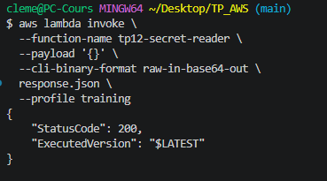
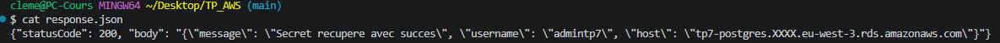
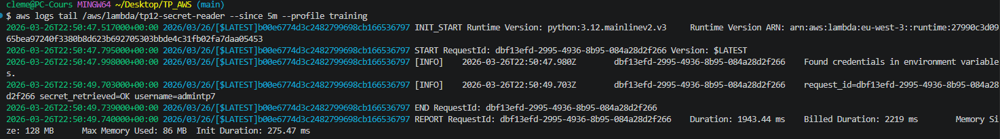
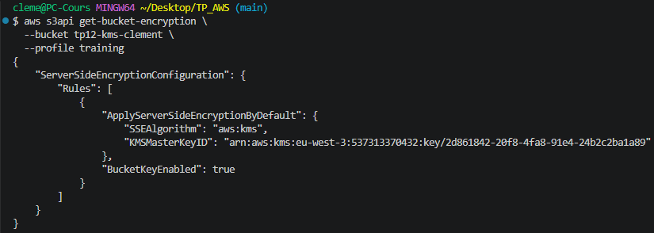
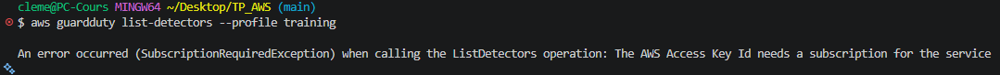

# TP 12 : KMS + Secrets Manager — Chiffrement et gestion des secrets
 
## Objectif
 
Mettre en place une gestion sécurisée des secrets et du chiffrement :
créer une clé KMS dédiée au projet, l'utiliser pour chiffrer un bucket S3 et un secret Secrets Manager,
puis démontrer qu'une Lambda peut récupérer dynamiquement un secret au runtime sans jamais l'exposer dans les logs ou les réponses API.
 
## Infrastructure as Code — Terraform
 
Ce TP a été entièrement réalisé avec **Terraform**. L'ensemble des fichiers sont disponibles dans ce dépôt.
 
### Structure des fichiers
 
| Fichier | Rôle |
|---|---|
| `versions.tf` | Déclaration du provider AWS, région lue depuis le state de `base/` |
| `variables.tf` | Variables sensibles : `db_password` et `db_host` |
| `terraform.tfvars` | Valeurs des variables (non versionné — voir `.gitignore`) |
| `main.tf` | Clé KMS, bucket S3, secret Secrets Manager, rôle IAM, Lambda |
| `outputs.tf` | Output de l'alias KMS et du nom du secret |
| `lambda_secrets.py` | Code de la Lambda (Python 3.12) |
 
## Ressources créées
 
### 1. Clé KMS (`alias/tp12-key`)
- Rotation automatique activée (`enable_key_rotation = true`)
- Fenêtre de suppression : 7 jours (minimum AWS)
- Policy restreinte à 3 principals :
  - **Root du compte** : accès administrateur complet (`kms:*`)
  - **Secrets Manager** : `kms:Decrypt` et `kms:GenerateDataKey` uniquement
  - **Lambda** (via son rôle IAM) : `kms:Decrypt` uniquement
- `BucketKeyEnabled = true` sur S3 — réduit le nombre d'appels KMS et donc les coûts
 
### 2. Bucket S3 chiffré KMS (`tp12-kms-clement`)
- Algorithme : `aws:kms` avec la clé dédiée `alias/tp12-key`
- Chiffrement côté serveur appliqué sur tous les objets par défaut
- Blocage public sur les 4 paramètres
- `force_destroy = true` pour le teardown en contexte lab
 
### 3. Secret Secrets Manager (`tp12/db-credentials`)
- Chiffré avec la clé KMS `alias/tp12-key`
- Contient les credentials RDS du TP7 : `username`, `password`, `host`, `port`, `dbname`
- `recovery_window_in_days = 0` — suppression immédiate possible en contexte lab (en production : 7 à 30 jours)
- Le mot de passe n'est **jamais** écrit en clair dans le code — il est injecté via `terraform.tfvars`
 
### 4. Rôle IAM Lambda (minimal)
| Permission | Resource | Justification |
|---|---|---|
| `secretsmanager:GetSecretValue` | ARN du secret uniquement | Lecture du secret au runtime |
| `kms:Decrypt` | ARN de la clé uniquement | Déchiffrement du secret |
| `logs:*` | Log group dédié | Via `AWSLambdaBasicExecutionRole` |
 
### 5. Lambda (`tp12-secret-reader`)
- Lit le secret depuis Secrets Manager **au runtime** — jamais stocké en variable d'environnement
- Logue `username` et `host` pour confirmer la récupération
- Ne logue **jamais** le password — absent des logs et de la réponse HTTP
- Démontre le pattern à suivre en production : les credentials ne transitent que dans la mémoire de la fonction, le temps de l'exécution
 
### 6. GuardDuty — non disponible sur compte lab
 
GuardDuty nécessite une souscription au service non disponible sur le compte étudiant.
Le bloc Terraform correspondant est commenté dans `main.tf`.
 
En production, l'activation se ferait via :
```hcl
resource "aws_guardduty_detector" "tp12" {
  enable = true
}
```
 
## Tests de validation
 
### Invocation de la Lambda
 
```bash
aws lambda invoke \
  --function-name tp12-secret-reader \
  --payload '{}' \
  --cli-binary-format raw-in-base64-out \
  response.json \
  --profile training
```
 
L'invocation retourne HTTP 200 — le secret a été récupéré et déchiffré avec succès :
 

 
### Vérification de la réponse — password absent
 
```bash
cat response.json
```
 
La réponse contient `username` et `host` mais **pas le password** :
 

 
```json
{
  "statusCode": 200,
  "body": {
    "message": "Secret recupere avec succes",
    "username": "admintp7",
    "host": "tp7-postgres.XXXX.eu-west-3.rds.amazonaws.com"
  }
}
```
 
### Vérification des logs — password absent
 
```bash
MSYS_NO_PATHCONV=1 aws logs tail /aws/lambda/tp12-secret-reader \
  --since 5m --profile training
```
 
Les logs confirment `secret_retrieved=OK username=admintp7` — le password n'apparaît nulle part dans CloudWatch :
 

 
### Vérification du chiffrement KMS sur S3
 
```bash
aws s3api get-bucket-encryption \
  --bucket tp12-kms-clement \
  --profile training
```
 
Le bucket utilise bien `aws:kms` avec la clé dédiée et `BucketKeyEnabled: true` :
 

 
### GuardDuty — non disponible sur ce compte
 
```bash
aws guardduty list-detectors --profile training
```
 

 
La commande retourne une `SubscriptionRequiredException` — GuardDuty requiert une souscription non disponible sur le compte lab. La ressource a été commentée dans le code Terraform. En production, elle s'activerait sans modification supplémentaire.
 
## Contrôles sécurité appliqués
 
- Clé KMS dédiée au projet avec **rotation automatique** — compromission d'une version de clé n'expose pas les données chiffrées avec les versions précédentes
- Policy KMS **restrictive** — chaque principal n'a que les droits strictement nécessaires
- Secret stocké dans Secrets Manager, **chiffré avec KMS** — double couche de protection
- Mot de passe **jamais en clair** dans le code, les logs ou les réponses API
- Lambda lit le secret **au runtime** uniquement — pas de stockage intermédiaire
- Bucket S3 entièrement privé avec chiffrement KMS sur tous les objets
- Tags obligatoires appliqués sur toutes les ressources (`Project`, `Owner`, `Env`, `CostCenter`)
 
## Teardown
 
```bash
aws s3 rm s3://tp12-kms-clement --recursive --profile training
terraform destroy -auto-approve
# La clé KMS sera définitivement supprimée après 7 jours (délai minimum AWS)
```