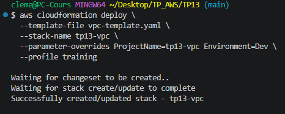
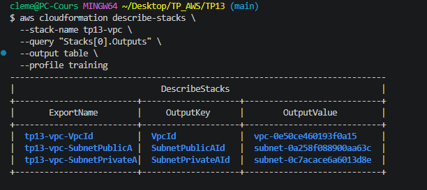
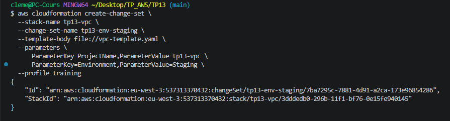
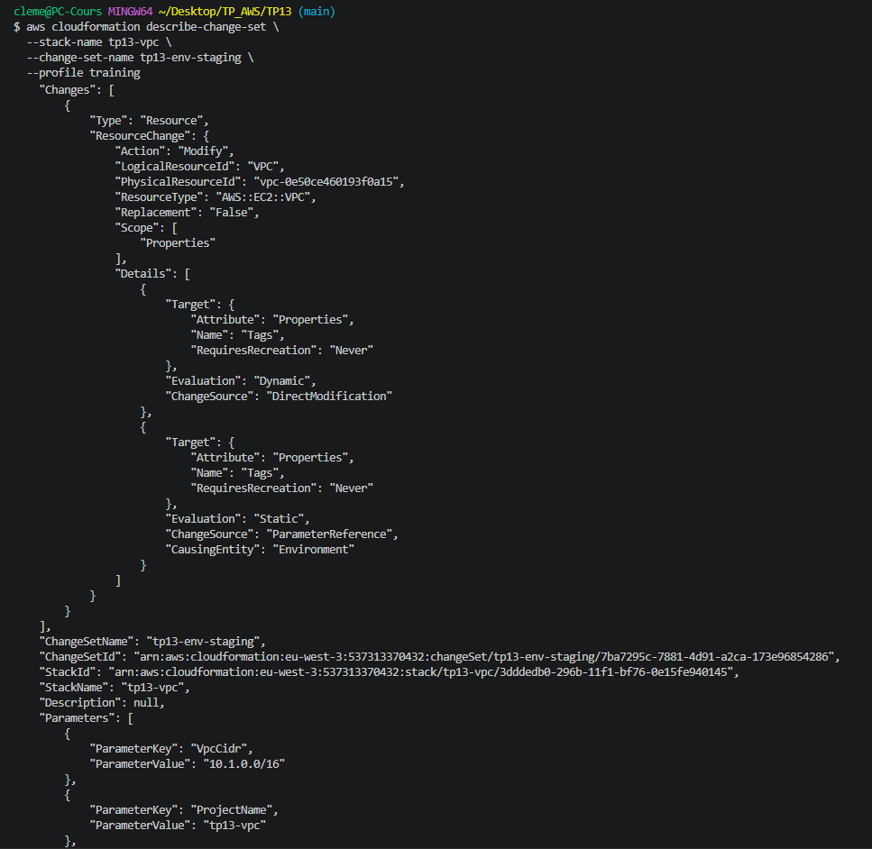
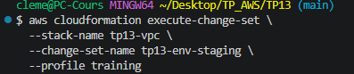
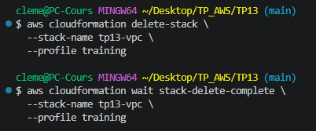

# TP 13 : CloudFormation — Socle réseau reproductible
 
## Objectif
 
Déployer un socle VPC complet via un template CloudFormation paramétré.
Démontrer le cycle de vie d'une stack : déploiement initial, modification contrôlée via Change Set, et suppression propre.
Comparer l'approche CloudFormation avec Terraform utilisé dans les TPs précédents.
 
## Approche — CloudFormation (YAML)
 
> Ce TP utilise **AWS CloudFormation** et non Terraform. C'est le seul TP du module réalisé nativement avec l'outil IaC d'AWS.
 
### Structure des fichiers
 
| Fichier | Rôle |
|---|---|
| `vpc-template.yaml` | Template CloudFormation paramétré — VPC, subnets, IGW, NAT GW, route tables |
 
Aucun fichier de variables sensibles — tous les paramètres ont des valeurs par défaut ou sont passés en ligne de commande.
 
## Ressources créées par la stack
 
Le template déploie un socle réseau complet en une seule commande :
 
| Ressource | Type CloudFormation | Description |
|---|---|---|
| VPC | `AWS::EC2::VPC` | CIDR `10.1.0.0/16`, DNS activé |
| SubnetPublicA/B | `AWS::EC2::Subnet` | Subnets publics sur 2 AZ |
| SubnetPrivateA/B | `AWS::EC2::Subnet` | Subnets privés sur 2 AZ |
| InternetGateway | `AWS::EC2::InternetGateway` | Attachée au VPC |
| NatGateway | `AWS::EC2::NatGateway` | EIP dédiée, placée en subnet public A |
| RouteTablePublic | `AWS::EC2::RouteTable` | Route `0.0.0.0/0` → IGW |
| RouteTablePrivate | `AWS::EC2::RouteTable` | Route `0.0.0.0/0` → NAT GW |
 
### Paramètres du template
 
| Paramètre | Valeur par défaut | Valeurs autorisées |
|---|---|---|
| `ProjectName` | `tp13-vpc` | Libre |
| `VpcCidr` | `10.1.0.0/16` | Libre |
| `Environment` | `Dev` | `Dev`, `Staging`, `Prod` |
 
### Outputs exportés
 
Les 3 outputs sont exportés avec `Export.Name` pour être réutilisables par d'autres stacks CloudFormation :
 
| Export | Valeur |
|---|---|
| `tp13-vpc-VpcId` | ID du VPC créé |
| `tp13-vpc-SubnetPublicA` | ID du subnet public A |
| `tp13-vpc-SubnetPrivateA` | ID du subnet privé A |
 
## Déploiement et tests
 
### Déploiement initial
 
```bash
aws cloudformation deploy \
  --template-file vpc-template.yaml \
  --stack-name tp13-vpc \
  --parameter-overrides ProjectName=tp13-vpc Environment=Dev \
  --profile training
```
 
CloudFormation crée un change set interne, attend la completion et confirme le succès :
 

 
### Vérification des outputs
 
```bash
aws cloudformation describe-stacks \
  --stack-name tp13-vpc \
  --query "Stacks[0].Outputs" \
  --output table \
  --profile training
```
 
Les 3 outputs sont disponibles avec leurs valeurs et noms d'export :
 

 
### Modification via Change Set — passage à `Staging`
 
Le Change Set est le mécanisme CloudFormation qui permet de **prévisualiser les changements** avant de les appliquer, équivalent du `terraform plan`.
 
**Étape 1 — créer le Change Set :**
 
```bash
aws cloudformation create-change-set \
  --stack-name tp13-vpc \
  --change-set-name tp13-env-staging \
  --template-body file://vpc-template.yaml \
  --parameters \
    ParameterKey=ProjectName,ParameterValue=tp13-vpc \
    ParameterKey=Environment,ParameterValue=Staging \
  --profile training
```
 

 
**Étape 2 — inspecter les changements prévus :**
 
```bash
aws cloudformation describe-change-set \
  --stack-name tp13-vpc \
  --change-set-name tp13-env-staging \
  --profile training
```
 
Le Change Set identifie une modification de type `Modify` sur le VPC (`AWS::EC2::VPC`), avec `Replacement: False` — le VPC sera mis à jour en place, sans recréation :
 

 
> **Interprétation :** `RequiresRecreation: Never` confirme que le changement de tag `Env: Dev → Staging` ne nécessite pas de recréation de la ressource. C'est une modification non destructive.
 
**Étape 3 — appliquer le Change Set :**
 
```bash
aws cloudformation execute-change-set \
  --stack-name tp13-vpc \
  --change-set-name tp13-env-staging \
  --profile training
```
 

 
### Suppression de la stack
 
```bash
aws cloudformation delete-stack \
  --stack-name tp13-vpc \
  --profile training
 
aws cloudformation wait stack-delete-complete \
  --stack-name tp13-vpc \
  --profile training
```
 
La commande `wait` bloque jusqu'à confirmation de la suppression complète de toutes les ressources :
 

 
## CloudFormation vs Terraform — comparaison
 
| Critère | CloudFormation | Terraform |
|---|---|---|
| Origine | Natif AWS | Multi-cloud (HashiCorp) |
| Langage | YAML / JSON | HCL |
| State | Géré par AWS (invisible) | Fichier `.tfstate` local ou distant |
| Plan avant apply | Change Set (explicite) | `terraform plan` (automatique) |
| Portabilité | AWS uniquement | AWS, GCP, Azure, etc. |
| Modules réutilisables | Nested stacks / StackSets | Modules Terraform |
| Gestion des secrets | SSM Parameter Store / Secrets Manager | Variables sensibles + `tfvars` |
 
> **Conclusion :** CloudFormation est bien intégré à l'écosystème AWS (pas de state à gérer, IAM natif) mais reste limité à AWS. Terraform offre plus de flexibilité et une syntaxe plus lisible, notamment pour les projets multi-cloud ou les équipes qui gèrent plusieurs providers.
 
## Teardown
 
```bash
aws cloudformation delete-stack \
  --stack-name tp13-vpc \
  --profile training
 
aws cloudformation wait stack-delete-complete \
  --stack-name tp13-vpc \
  --profile training
```