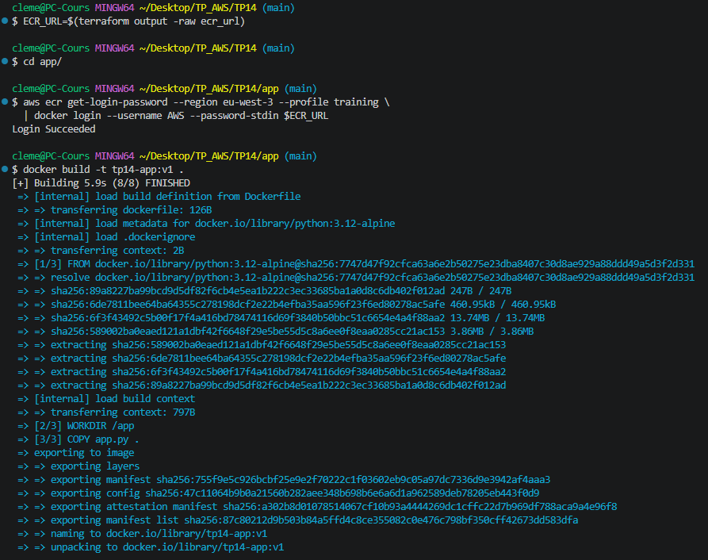
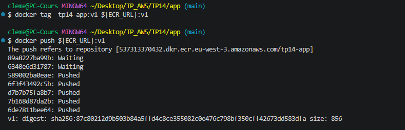
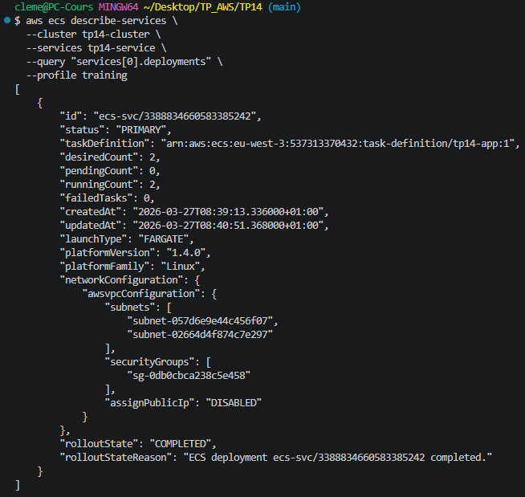
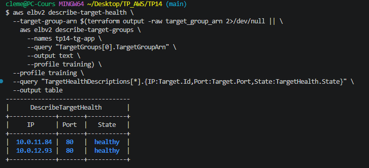
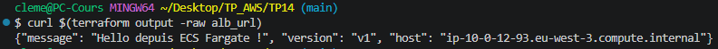
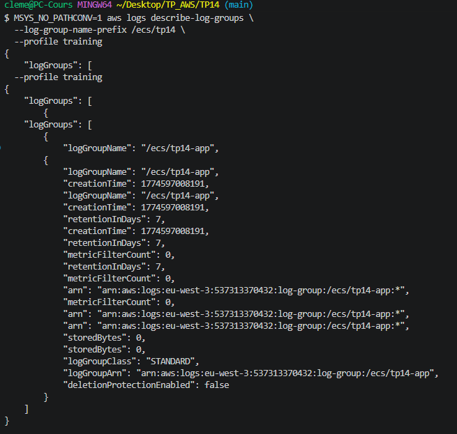
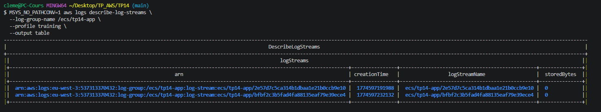
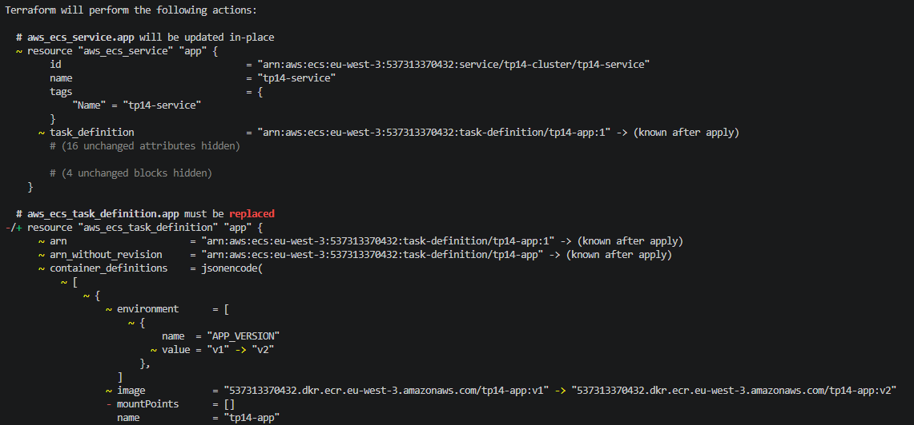
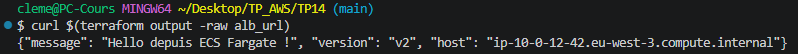

# TP 14 : ECS Fargate — Conteneur managé, ECR, ALB, Rolling Update
 
## Objectif
 
Conteneuriser une application Python, publier l'image sur ECR, déployer un service ECS Fargate hautement disponible dans les subnets privés, exposé via un ALB public.
Démontrer le rolling update sans interruption de service entre la version v1 et v2.
 
## Infrastructure as Code — Terraform
 
Ce TP a été entièrement réalisé avec **Terraform**. L'ensemble des fichiers sont disponibles dans ce dépôt.
 
### Structure des fichiers
 
| Fichier | Rôle |
|---|---|
| `versions.tf` | Déclaration du provider AWS, région lue depuis le state de `base/` |
| `main.tf` | ECR, ALB, SGs, rôle IAM ECS, cluster, task definition, service |
| `outputs.tf` | Outputs : URL ECR, URL ALB |
| `app/app.py` | Application Python — serveur HTTP minimal retournant du JSON |
| `app/Dockerfile` | Image basée sur `python:3.12-alpine` |
 
> **Note :** Aucune donnée sensible — pas de `variables.tf` ni `terraform.tfvars` pour ce TP.
 
## Architecture
 
```
Internet
    │
    │ HTTP :80
    ▼
ALB public (tp14-alb)          ← subnets publics, multi-AZ
    │  SG : ingress 80 depuis 0.0.0.0/0
    │
    │ forward vers Target Group
    ▼
Target Group (tp14-tg-app)     ← health check sur /
    │  type: ip, protocol: HTTP
    │
    ├── Task Fargate — ip-10-0-11-84   ← subnet privé A
    └── Task Fargate — ip-10-0-12-93   ← subnet privé B
         SG : ingress 80 depuis SG ALB uniquement
         assignPublicIp: DISABLED
```
 
## Ressources créées
 
### 1. ECR Repository (`tp14-app`)
- Scan automatique à chaque push (`scan_on_push = true`)
- Lifecycle policy : maximum 3 images conservées — suppression automatique des anciennes
 
### 2. Security Groups
- **SG ALB** : ingress port 80 depuis `0.0.0.0/0` — seul point d'entrée public
- **SG Tasks** : ingress port 80 **uniquement depuis le SG ALB** via `aws_security_group_rule` — les tasks ne sont jamais accessibles directement
 
### 3. ALB + Target Group + Listener
- ALB public déployé dans les 2 subnets publics (multi-AZ)
- Target Group de type `ip` (obligatoire pour Fargate en mode `awsvpc`)
- Health check sur `/` — `healthy_threshold = 2`, `unhealthy_threshold = 3`
 
### 4. Rôle IAM ECS Task Execution (`tp14-ecs-exec-role`)
- Policy `AmazonECSTaskExecutionRolePolicy` — permet à ECS de puller l'image ECR et d'écrire dans CloudWatch Logs
 
### 5. Task Definition (`tp14-app`)
- CPU : 256 units, Mémoire : 512 Mo (minimum Fargate)
- Driver de logs : `awslogs` → log group `/ecs/tp14-app` (rétention 7 jours)
- Variable d'environnement `APP_VERSION` injectée dans le conteneur
 
### 6. Service ECS (`tp14-service`)
- `desired_count = 2` — 2 tasks réparties sur 2 AZ
- `assign_public_ip = false` — tasks dans les subnets privés uniquement
- Rolling update natif : Terraform crée une nouvelle task definition à chaque `apply`, ECS remplace les tasks progressivement
 
## Déploiement
 
### Étape 1 — Build et push de l'image v1
 
Login Docker vers ECR, puis build de l'image :
 
```bash
ECR_URL=$(terraform output -raw ecr_url)
cd app/
 
aws ecr get-login-password --region eu-west-3 --profile training \
  | docker login --username AWS --password-stdin $ECR_URL
 
docker build -t tp14-app:v1 .
```
 

 
Tag et push vers ECR :
 
```bash
docker tag tp14-app:v1 ${ECR_URL}:v1
docker push ${ECR_URL}:v1
```
 

 
### Étape 2 — Déploiement de l'infrastructure
 
```bash
cd ..
terraform apply -auto-approve
```
 
## Tests de validation
 
### Vérification du déploiement ECS
 
```bash
aws ecs describe-services \
  --cluster tp14-cluster \
  --services tp14-service \
  --query "services[0].deployments" \
  --profile training
```
 
`runningCount: 2`, `pendingCount: 0`, `failedTasks: 0`, `rolloutState: COMPLETED` — le déploiement est terminé avec succès :
 

 
### Vérification des targets ALB
 
```bash
aws elbv2 describe-target-health \
  --target-group-arn $(aws elbv2 describe-target-groups \
    --names tp14-tg-app \
    --query "TargetGroups[0].TargetGroupArn" \
    --output text --profile training) \
  --profile training \
  --query "TargetHealthDescriptions[*].{IP:Target.Id,Port:Target.Port,State:TargetHealth.State}" \
  --output table
```
 
Les 2 tasks sont en état `healthy` côté ALB sur le port 80 :
 

 
### Test HTTP — accès via ALB
 
```bash
curl $(terraform output -raw alb_url)
```
 
L'application répond avec le JSON attendu, incluant la version et le host de la task qui a traité la requête :
 

 
### CloudWatch Logs — log group configuré
 
Le log group `/ecs/tp14-app` est créé avec une rétention de 7 jours. Les streams sont bien créés automatiquement par ECS au démarrage de chaque task (un stream par task) :
 

 

 
> **Note :** `storedBytes: 0` est attendu — le serveur HTTP Python ne produit pas de logs applicatifs dans cette implémentation. La présence des streams confirme que la configuration `awslogs` est correctement appliquée par ECS.
 
## Rolling Update v1 → v2
 
La mise à jour de version se fait sans interruption de service. Terraform détecte le changement d'image et de variable d'environnement, recrée la task definition, puis ECS remplace les tasks progressivement :
 
```bash
# Modifier l'image (:v1 → :v2) et APP_VERSION dans main.tf, puis :
terraform apply -auto-approve
```
 
Le plan Terraform montre clairement les changements : remplacement de la task definition (`-/+`) et mise à jour in-place du service (`~`) :
 

 
L'ALB répond bien avec `"version": "v2"` après le rolling update :
 

 
> **Validation rolling update :** pendant la transition, l'ALB continue de router vers les tasks v1 encore actives le temps que les tasks v2 passent leur health check. Le service ne subit aucune interruption.
 
## Contrôles sécurité appliqués
 
- Tasks Fargate dans les **subnets privés** — `assignPublicIp: DISABLED`
- SG Tasks : accès port 80 **uniquement depuis le SG ALB** — aucun accès direct possible
- Images ECR scannées automatiquement à chaque push
- Lifecycle policy ECR — suppression automatique des anciennes images (max 3)
- Rôle IAM ECS minimal — task execution role uniquement, pas de permissions applicatives supplémentaires
- Tags obligatoires appliqués sur toutes les ressources (`Project`, `Owner`, `Env`, `CostCenter`)
 
## Teardown
 
```bash
# Réduire le service à 0 task avant destroy
aws ecs update-service \
  --cluster tp14-cluster \
  --service tp14-service \
  --desired-count 0 \
  --profile training
 
sleep 30
 
# Supprimer les images ECR
aws ecr batch-delete-image \
  --repository-name tp14-app \
  --image-ids imageTag=v1 imageTag=v2 \
  --profile training
 
terraform destroy -auto-approve
```
