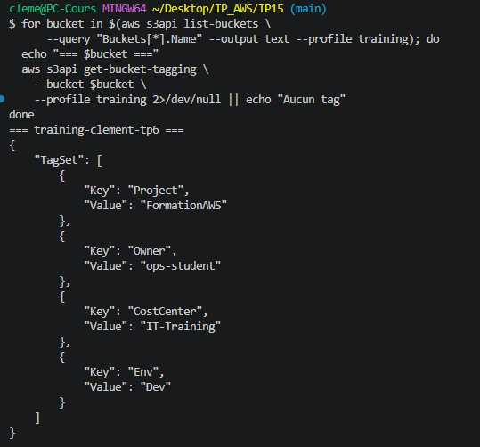
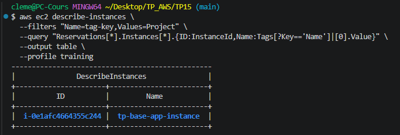

# TP 15 : FinOps — Budget, Audit des tags, Test de continuité, PRA
 
## Objectif
 
Mettre en place la gouvernance des coûts avec un budget AWS alertant,
auditer la conformité des tags sur l'ensemble des ressources,
simuler une panne et démontrer la restauration via Terraform,
et produire un runbook de Plan de Reprise d'Activité.
 
## Infrastructure as Code — Terraform
 
Ce TP a été entièrement réalisé avec **Terraform**. L'ensemble des fichiers sont disponibles dans ce dépôt.
 
### Structure des fichiers
 
| Fichier | Rôle |
|---|---|
| `versions.tf` | Déclaration du provider AWS, région lue depuis le state de `base/` |
| `variables.tf` | Variables `alert_email` et `budget_limit_usd` |
| `terraform.tfvars` | Valeurs des variables (non versionné — voir `.gitignore`) |
| `main.tf` | Budget AWS avec alertes SNS |
 
## Ressources créées
 
### Budget AWS (`tp15-formation-aws`)
- Type : **COST**, plafond mensuel : **20 $**
- Filtre sur le tag `Project = FormationAWS` — suit uniquement les coûts du projet
- Deux alertes configurées :
  - **80% du budget réel** → email immédiat
  - **100% du budget prévisionnel** → alerte anticipée avant dépassement
 
## Audit des tags
 
L'audit vérifie que toutes les ressources du projet portent bien les 5 tags obligatoires : `Project`, `Owner`, `Env`, `CostCenter`, `Name`.
 
### Ressources taggées `FormationAWS`
 
```bash
aws resourcegroupstaggingapi get-resources \
  --tag-filters Key=Project,Values=FormationAWS \
  --profile training \
  --output table
```
 
La commande retourne l'ensemble des ressources actives taggées avec `Project=FormationAWS`.
Extrait des ressources identifiées (toutes issues du dossier `base/` encore déployé) :
 
```
IGW        : igw-0caf665e302552cfd   → tp-base-igw
Route Table: rtb-01db35eec895ccbe9  → tp-base-rtb-private
SG         : sg-0fad952e4e43d72d1   → tp-base-sg-app
Subnet     : subnet-03cf34decb2dc192c → tp-base-subnet-public-b
Subnet     : subnet-019d2dafc0c955925 → tp-base-subnet-public-a
Volume EBS : vol-075d9dd020bdb5df6
ECS Service: tp14-cluster/tp14-service → tp14-service
Task Def   : tp14-app:1              → tp14-task-def
```
 
### Audit des instances EC2 taggées
 
```bash
aws ec2 describe-instances \
  --filters "Name=tag-key,Values=Project" \
  --query "Reservations[*].Instances[*].{ID:InstanceId,Name:Tags[?Key=='Name']|[0].Value}" \
  --output table \
  --profile training
```
 

 
### Audit des tags S3
 
```bash
for bucket in $(aws s3api list-buckets \
    --query "Buckets[*].Name" --output text --profile training); do
  echo "=== $bucket ==="
  aws s3api get-bucket-tagging \
    --bucket $bucket \
    --profile training 2>/dev/null || echo "Aucun tag"
done
```
 
Le bucket `training-clement-tp6` (TP6) porte bien les 4 tags obligatoires :
 

 
## Identification des 3 postes de coût
 
Analyse des ressources les plus coûteuses rencontrées pendant la formation :
 
### Poste 1 — NAT Gateway (~0,045 $/h ≈ 1 $/jour)
Le poste le plus coûteux en fonctionnement continu — présent dans `base/`, TP13 et TP14.
**Action de maîtrise :** détruire après chaque session de travail.
```bash
terraform destroy -target=aws_nat_gateway.nat -target=aws_eip.nat -auto-approve
```
 
### Poste 2 — RDS db.t3.micro (~0,02 $/h ≈ 15 $/mois hors Free Tier)
Gratuit les 750 premières heures sur un nouveau compte (Free Tier).
**Action de maîtrise :** `skip_final_snapshot = true` + `terraform destroy` immédiatement après le TP7.
 
### Poste 3 — ALB Application Load Balancer (~0,008 $/h ≈ 6 $/mois)
Utilisé en TP5 et TP14 uniquement.
**Action de maîtrise :** détruire immédiatement après la démo, ne jamais laisser tourner la nuit.
 
> **Bilan formation :** en détruisant les ressources après chaque TP, le coût total de la formation a été maintenu sous 5 $ grâce à la discipline de teardown systématique et à l'utilisation du Free Tier sur RDS et Lambda.
 
## Test de continuité — Simulation de panne EC2
 
### Contexte
L'instance EC2 du dossier `base/` est déployée seule, sans Auto Scaling Group.
Ce test démontre que sans ASG, la restauration nécessite une intervention manuelle — contrairement au TP5 où l'ASG recréait automatiquement l'instance.
La valeur de l'IaC est ici évidente : un simple `terraform apply` suffit à restaurer l'état désiré.
 
### État initial — instance running
 
```bash
aws ec2 describe-instances \
  --filters "Name=tag:Name,Values=tp-base-app-instance" \
  --query "Reservations[0].Instances[0].{ID:InstanceId,State:State.Name,AZ:Placement.AvailabilityZone}" \
  --output table \
  --profile training
```
 
```
--------------------------------------------------
|                DescribeInstances               |
+-------------+-----------------------+----------+
|     AZ      |          ID           |  State   |
+-------------+-----------------------+----------+
|  eu-west-3a |  i-0e1afc4664355c244  |  running |
+-------------+-----------------------+----------+
```
 
### Simulation de panne — termination de l'instance
 
```bash
aws ec2 terminate-instances \
  --instance-ids i-0e1afc4664355c244 \
  --profile training
```
 
```json
{
  "TerminatingInstances": [{
    "InstanceId": "i-0e1afc4664355c244",
    "CurrentState":  { "Name": "shutting-down" },
    "PreviousState": { "Name": "running" }
  }]
}
```
 
### Confirmation de la panne
 
```bash
aws ec2 describe-instances \
  --filters "Name=tag:Name,Values=tp-base-app-instance" \
  --query "Reservations[0].Instances[0].{ID:InstanceId,State:State.Name}" \
  --output table \
  --profile training
```
 
```
---------------------------------------
|          DescribeInstances          |
+----------------------+--------------+
|          ID          |    State     |
+----------------------+--------------+
|  i-0e1afc4664355c244 |  terminated  |
+----------------------+--------------+
```
 
### Restauration via Terraform
 
```bash
cd base/
terraform apply -auto-approve
```
 
Terraform détecte que l'instance `i-0e1afc4664355c244` n'existe plus et en crée une nouvelle avec un ID différent, dans la même configuration (subnet privé, SG, IAM, user_data).
 
**Résultat :** nouvelle instance `i-0e1afc4664355c244` → `i-0ebebd283dc946954` recréée en moins de 2 minutes.

--------------------------------------------------
|                DescribeInstances               |
+-------------+-----------------------+----------+
|     AZ      |          ID           |  State   |
+-------------+-----------------------+----------+
|  eu-west-3a |  i-0ebebd283dc946954  |  running |
+-------------+-----------------------+----------+
 
> **Conclusion :** sans ASG, la restauration n'est pas automatique mais reste rapide et reproductible grâce à Terraform. En production, on combinerait les deux : ASG pour la résilience automatique, Terraform pour la reproductibilité de l'infrastructure complète.
 
---
 
## Runbook PRA — VALENTIN Clément
 
**Périmètre :** ALB public → EC2 privé → RDS PostgreSQL
**RTO (Recovery Time Objective) :** 5 minutes
**RPO (Recovery Point Objective) :** 24 heures (backup RDS quotidien)
 
---
 
### Incident 1 : Panne instance EC2
 
**Symptôme :** instance EC2 inaccessible, health check ALB UNHEALTHY
 
**Détection automatique :** si l'instance est dans un ASG → remplacement automatique en 2-3 min
 
**Actions si pas d'ASG ou si l'ASG ne réagit pas :**
```bash
# 1. Vérifier l'état de l'instance
aws ec2 describe-instances \
  --filters "Name=tag:Name,Values=tp-base-app-instance" \
  --query "Reservations[0].Instances[0].{ID:InstanceId,State:State.Name}" \
  --output table --profile training
 
# 2. Restaurer via Terraform
cd base/
terraform apply -auto-approve
 
# 3. Valider le health check ALB
aws elbv2 describe-target-health \
  --target-group-arn <arn> --profile training
```
 
**Validation :** nouvelle instance en état `running`, targets ALB en état `healthy`
 
---
 
### Incident 2 : Corruption de données RDS
 
**Symptôme :** erreurs SQL applicatives, données incohérentes
 
```bash
# 1. Identifier le dernier snapshot valide
aws rds describe-db-snapshots \
  --db-instance-identifier tp7-postgres \
  --profile training
 
# 2. Restaurer depuis le snapshot
aws rds restore-db-instance-from-db-snapshot \
  --db-instance-identifier tp7-restore \
  --db-snapshot-identifier tp7-snapshot-manuel \
  --profile training
 
# 3. Mettre à jour le secret Secrets Manager avec le nouvel endpoint
aws secretsmanager update-secret \
  --secret-id tp12/db-credentials \
  --secret-string '{"host":"<nouvel_endpoint>","username":"admintp7",...}' \
  --profile training
 
# 4. Redémarrer les EC2 pour prendre en compte le nouveau host
terraform -chdir=base/ apply -replace=aws_instance.app -auto-approve
```
 
**Validation :** connexion à la base OK, données intègres vérifiées
 
---
 
### Incident 3 : Erreurs Lambda en cascade (DLQ pleine)
 
**Symptôme :** alarme `tp11-dlq-not-empty` active, messages bloqués
 
```bash
# 1. Lire le message bloqué dans la DLQ
aws sqs receive-message \
  --queue-url <dlq_url> --profile training
 
# 2. Analyser les logs du consumer
MSYS_NO_PATHCONV=1 aws logs tail /aws/lambda/tp10-consumer \
  --since 30m --profile training
 
# 3. Corriger le code Lambda et redéployer
cd TP10/
terraform apply -auto-approve
 
# 4. Purger la DLQ après correction
aws sqs purge-queue --queue-url <dlq_url> --profile training
```
 
**Validation :** alarme `tp11-dlq-not-empty` en état OK, métriques Lambda sans erreurs
 
---
 
### Checklist de restauration générale
 
- [ ] Incident détecté et heure notée
- [ ] Impact évalué (nombre d'utilisateurs affectés, SLA impacté)
- [ ] Actions correctives appliquées
- [ ] Tests de validation réalisés
- [ ] Rapport d'incident rédigé (timeline, cause racine, mesures de prévention)
 
---
 
## Teardown final
 
```bash
# Destruction dans l'ordre — dépendants d'abord
cd base/ && terraform destroy -auto-approve
```
