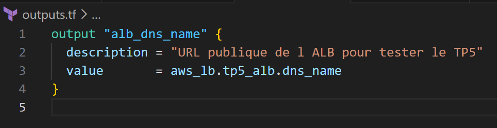
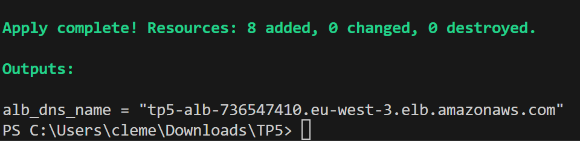
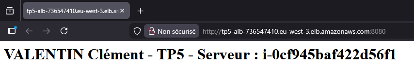

# TP 5 : Haute disponibilité — ALB public, ASG privé, Health Checks

## Objectif

Mettre en place un frontal L7 (Application Load Balancer) et une couche compute élastique multi-AZ.
Démontrer l'auto-réparation et la continuité de service via un Auto Scaling Group.

## Infrastructure as Code — Terraform

Ce TP a été entièrement réalisé avec **Terraform**. L'ensemble des fichiers sont disponibles dans ce dépôt.

### Structure des fichiers

| Fichier | Rôle |
|---|---|
| `version.tf` | Déclaration du provider AWS, région `eu-west-3`, profil `training` |
| `variables.tf` | Déclaration des variables (VPC, subnets, SGs, AMI...) |
| `vars.tfvars` | Valeurs des variables (non versionné — voir `.gitignore`) |
| `main.tf` | Toutes les ressources AWS créées pour ce TP |
| `outputs.tf` | Output du DNS de l'ALB après `terraform apply` |

## Ressources créées

### 1. Security Group ALB (`tp5-sg-alb`)
- Ingress : ports **80**, **443** et **8080** depuis `0.0.0.0/0`
- Egress : port **80** uniquement vers le CIDR VPC `10.0.0.0/16` (principe du moindre privilège)
- Règle complémentaire : `aws_security_group_rule` autorisant le **port 80 depuis le SG ALB vers les instances App** (`SGAPP`)

### 2. Launch Template (`tp5-launch-template`)
- AMI : Amazon Linux 2023
- Type : `t3.micro`
- Pas de clé SSH — **administration via SSM Session Manager uniquement**
- `HttpTokens = required` → **IMDSv2 forcé** (protection contre les attaques SSRF)
- `associate_public_ip_address = false` → instances dans les **subnets privés uniquement**
- `user_data` : installe Apache (httpd), affiche l'`instance_id` sur la page d'accueil pour valider la répartition de charge

### 3. Target Group (`tp5-target-group`)
- Port : **80 / HTTP**
- Health check sur `/` avec les paramètres suivants :
  - `healthy_threshold = 2`
  - `unhealthy_threshold = 3`
  - `interval = 30s`, `timeout = 5s`
  - Matcher : code HTTP `200`

### 4. Application Load Balancer (`tp5-alb`)
- Type : **public** (`internal = false`)
- Déployé dans les **subnets publics** (`PUB1`, `PUB2`) — multi-AZ
- Listener **port 80** : redirection permanente `HTTP 301` vers HTTPS (bonne pratique sécurité)
- Listener **port 8080** : forward direct vers le Target Group (port de test fonctionnel TP)

> **Note sécurité :** La redirection 80 → 443 a été mise en place pour démontrer la bonne pratique.
> L'accès fonctionnel se fait sur le port 8080 car aucun certificat SSL n'est disponible dans ce contexte de lab.

### 5. Auto Scaling Group (`tp5-asg`)
- `desired_capacity = 2`, `min_size = 1`, `max_size = 4`
- Déployé dans les **subnets privés** (`PRIV1`, `PRIV2`) — les instances ne sont jamais exposées directement
- `health_check_type = "ELB"` — l'ASG se base sur le health check de l'ALB
- `health_check_grace_period = 120s`
- Stratégie de refresh : **Rolling** avec `min_healthy_percentage = 50`
- Tags propagés sur chaque instance : `Name`, `Project`, `Env`, `Owner`, `CostCenter`

## Output Terraform

Après `terraform apply`, le DNS de l'ALB est disponible directement grâce au fichier outputs.tf que l'on a créé :



## Tests de validation

### ALB accessible sur le port 8080



```
http://tp5-alb-736547410.eu-west-3.elb.amazonaws.com:8080
```



Si on refresh, le load balancing nous fait passer sur le second serveur :


### Health check des instances ASG

```powershell
aws autoscaling describe-auto-scaling-groups `
  --auto-scaling-group-names "tp5-asg" `
  --query "AutoScalingGroups[0].Instances[*].{ID:InstanceId,AZ:AvailabilityZone,State:LifecycleState,Health:HealthStatus}" `
  --output table `
  --profile training
```

État initial — 2 instances `Healthy` et `InService` sur deux AZ différentes :

```
---------------------------------------------------------------
|                  DescribeAutoScalingGroups                  |
+------------+----------+-----------------------+-------------+
|     AZ     | Health   |          ID           |    State    |
+------------+----------+-----------------------+-------------+
|  eu-west-3b|  Healthy |  i-055b7a4016c213447  |  InService  |
|  eu-west-3a|  Healthy |  i-0cf945baf422d56f1  |  InService  |
+------------+----------+-----------------------+-------------+
```

### Simulation de panne — Auto-réparation

Terminaison manuelle de l'instance `i-055b7a4016c213447` pour simuler une panne :

```powershell
aws ec2 terminate-instances `
    --instance-ids i-055b7a4016c213447 `
    --profile training
```

**Pendant la panne** — l'ASG détecte l'instance `Unhealthy` et crée automatiquement un remplaçant :

```
-------------------------------------------------------------------
|                    DescribeAutoScalingGroups                    |
+------------+------------+-----------------------+---------------+
|     AZ     |  Health    |          ID           |     State     |
+------------+------------+-----------------------+---------------+
|  eu-west-3b|  Unhealthy |  i-055b7a4016c213447  |  Terminating  |
|  eu-west-3b|  Healthy   |  i-09183e9de965e0c61  |  InService    |
|  eu-west-3a|  Healthy   |  i-0cf945baf422d56f1  |  InService    |
+------------+------------+-----------------------+---------------+
```

**Après remplacement automatique** — 2 instances `Healthy` avec un nouvel ID :

```
---------------------------------------------------------------
|                  DescribeAutoScalingGroups                  |
+------------+----------+-----------------------+-------------+
|     AZ     | Health   |          ID           |    State    |
+------------+----------+-----------------------+-------------+
|  eu-west-3b|  Healthy |  i-09183e9de965e0c61  |  InService  |
|  eu-west-3a|  Healthy |  i-0cf945baf422d56f1  |  InService  |
+------------+----------+-----------------------+-------------+
```

> ✅ **Validation :** L'ASG a bien remplacé automatiquement l'instance terminée pour maintenir `desired_capacity = 2`.
> Le résultat complet du health check est disponible dans `exports/HealthCheck.json`.

## Contrôles sécurité appliqués

- ✅ Seul l'ALB est exposé sur internet — instances privées sans IP publique
- ✅ SG ALB → instances uniquement sur port applicatif (80) — aucun autre port autorisé
- ✅ IMDSv2 forcé sur toutes les instances (`HttpTokens = required`)
- ✅ Pas de clé SSH — administration via SSM Session Manager
- ✅ Redirection HTTP 301 vers HTTPS mise en place sur le listener port 80
- ✅ Tags obligatoires appliqués sur toutes les ressources (`Project`, `Owner`, `Env`, `CostCenter`)

## Teardown

> ⚠️ Conserver l'ALB et l'ASG pour les séances suivantes selon les consignes.

```bash
terraform destroy -var-file=vars.tfvars
```
