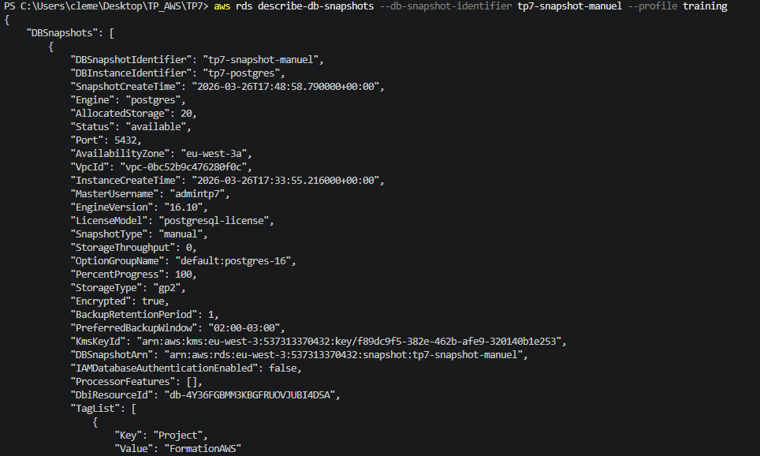
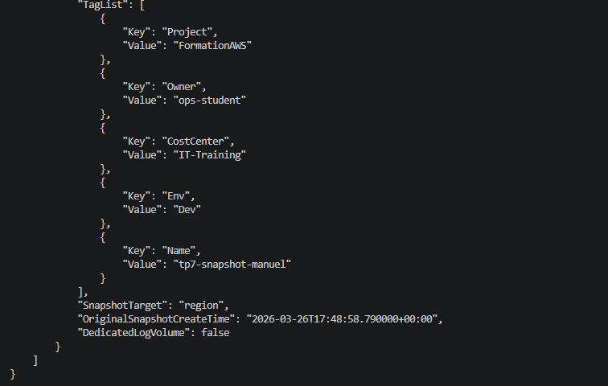
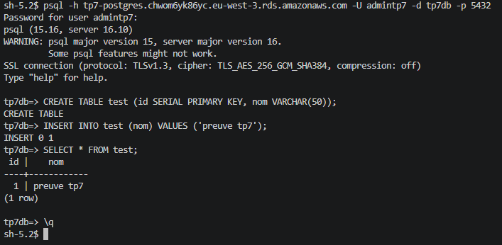

# TP 7 : RDS PostgreSQL — Base privée, SG restrictif, Snapshot

## Objectif

Déployer une base de données PostgreSQL managée (Amazon RDS) dans les subnets privés du VPC.
Démontrer l'isolation réseau par Security Group, le chiffrement au repos, les sauvegardes automatiques et la création d'un snapshot manuel.

## Infrastructure as Code — Terraform

Ce TP a été entièrement réalisé avec **Terraform**. L'ensemble des fichiers sont disponibles dans ce dépôt.

### Structure des fichiers

| Fichier | Rôle |
|---|---|
| `versions.tf` | Déclaration du provider AWS, région lue depuis le state de `base/` |
| `variables.tf` | Déclaration des variables sensibles (`db_password`) |
| `terraform.tfvars` | Valeurs des variables (non versionné — voir `.gitignore`) |
| `main.tf` | Toutes les ressources AWS créées pour ce TP |
| `outputs.tf` | Output de l'endpoint RDS et de l'identifiant du snapshot |

> **Note architecture :** Les IDs de VPC, subnets et Security Groups sont lus dynamiquement depuis le state Terraform du dossier `base/` via `terraform_remote_state`. Aucun identifiant n'est écrit en dur dans le code.

## Ressources créées

### 1. DB Subnet Group (`tp7-db-subnet-group`)
- Regroupe les deux **subnets privés** (`private-a`, `private-b`) issus du VPC de base
- Garantit que l'instance RDS est déployée dans une zone réseau non accessible depuis internet

### 2. Security Group RDS (`tp7-sg-rds`)
- Aucune règle ingress inline — la règle est déclarée via une ressource `aws_security_group_rule` séparée
- Ingress : port **5432** (PostgreSQL) autorisé **uniquement depuis le SG app** (`sg_app` de `base/`)
- Egress : tout le trafic sortant autorisé (nécessaire pour les mises à jour de moteur)
- Toute tentative de connexion depuis l'extérieur du VPC est bloquée

### 3. Instance RDS PostgreSQL (`tp7-postgres`)
- Moteur : **PostgreSQL 16**, classe `db.t3.micro` (Free Tier éligible)
- Stockage : **20 Go gp2**, chiffrement activé (`storage_encrypted = true`)
- `publicly_accessible = false` — aucune exposition directe sur internet
- `multi_az = false` — désactivé pour limiter les coûts en contexte de lab
- Fenêtre de backup : `02:00–03:00`, rétention **1 jour**
- `deletion_protection = false` et `skip_final_snapshot = true` pour permettre le teardown en TP

### 4. Snapshot manuel (`tp7-snapshot-manuel`)
- Déclenché explicitement par Terraform via la ressource `aws_db_snapshot`
- Chiffré (héritage du chiffrement de l'instance source)
- Tags propagés : `Project`, `Owner`, `Env`, `CostCenter`, `Name`

#### Correctif appliqué — `identifier` vs `id`

Lors du premier `terraform apply`, la création du snapshot échouait car RDS n'était pas encore disponible au moment où Terraform tentait de le créer.

Après investigation, l'erreur provenait de la référence utilisée dans la ressource `aws_db_snapshot` :

```hcl
# ❌ Référence incorrecte — utilise l'ID physique AWS (db-XXXXXXXXXX)
db_instance_identifier = aws_db_instance.postgres.id

# ✅ Référence correcte — utilise le nom logique (tp7-postgres)
db_instance_identifier = aws_db_instance.postgres.identifier
```

L'attribut `.id` retourne l'identifiant physique AWS généré (`db-4Y36FGBMM3KBGFRUOVJUBI4D5A`) alors que `.identifier` retourne le nom logique défini dans le code (`tp7-postgres`). L'API RDS pour les snapshots attend le nom logique — d'où l'échec silencieux avec `.id`.

## Tests de validation

### Vérification du snapshot

```powershell
aws rds describe-db-snapshots `
  --db-snapshot-identifier tp7-snapshot-manuel `
  --profile training
```

Le snapshot est en statut `available`, chiffré (`"Encrypted": true`), avec tous les tags propagés :




### Connexion depuis l'EC2 via SSM et requêtes de preuve

Après connexion à l'instance EC2 privée via SSM Session Manager et installation de `postgresql15` :

```bash
psql -h tp7-postgres.chwom6yk86yc.eu-west-3.rds.amazonaws.com \
     -U admintp7 -d tp7db -p 5432
```

> **Note :** La commande utilise l'endpoint RDS copié depuis l'output Terraform sur le poste local.
> Terraform n'étant pas installé sur l'EC2, la substitution `$(terraform output ...)` n'est pas utilisable directement depuis la session SSM.

La connexion s'établit en **TLS 1.3** (`TLS_AES_256_GCM_SHA384`) — chiffrement du transport activé par défaut sur RDS PostgreSQL.

Requêtes de preuve exécutées dans la base `tp7db` :

```sql
CREATE TABLE test (id SERIAL PRIMARY KEY, nom VARCHAR(50));
INSERT INTO test (nom) VALUES ('preuve tp7');
SELECT * FROM test;
```

Résultat confirmant l'accès fonctionnel à la base :



### Vérification de l'isolation réseau

La connexion depuis l'extérieur du VPC (poste local) est impossible : le paramètre `publicly_accessible = false` combiné au Security Group restrictif bloque toute tentative de connexion directe sur le port 5432 depuis internet.

## Contrôles sécurité appliqués

- Instance RDS déployée dans les **subnets privés** — non accessible depuis internet
- `publicly_accessible = false` — aucune IP publique assignée à l'instance
- Accès restreint **uniquement depuis le SG app** via `aws_security_group_rule` (port 5432)
- Chiffrement **au repos** activé (`storage_encrypted = true`)
- Chiffrement **en transit** actif par défaut (TLS 1.3 vérifié lors de la connexion psql)
- Backup automatique activé (rétention 1 jour, fenêtre dédiée)
- Snapshot manuel chiffré et taggé créé et vérifié
- Tags obligatoires appliqués sur toutes les ressources (`Project`, `Owner`, `Env`, `CostCenter`)

## Teardown

```bash
terraform destroy -auto-approve
```
