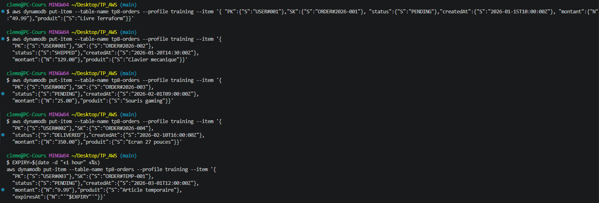
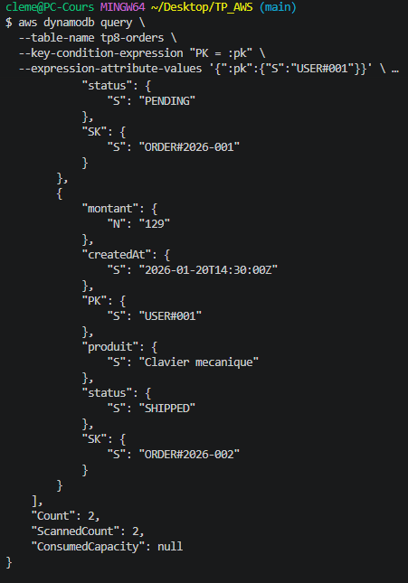
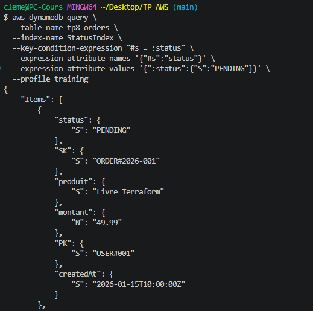
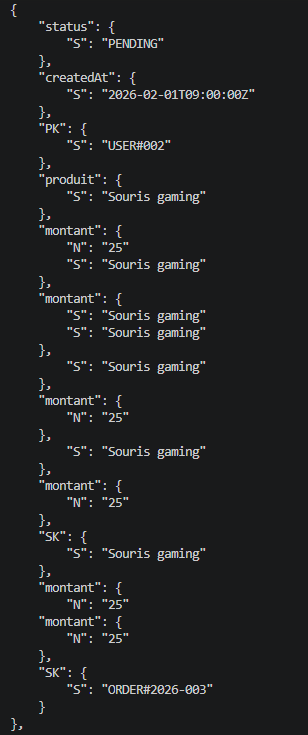
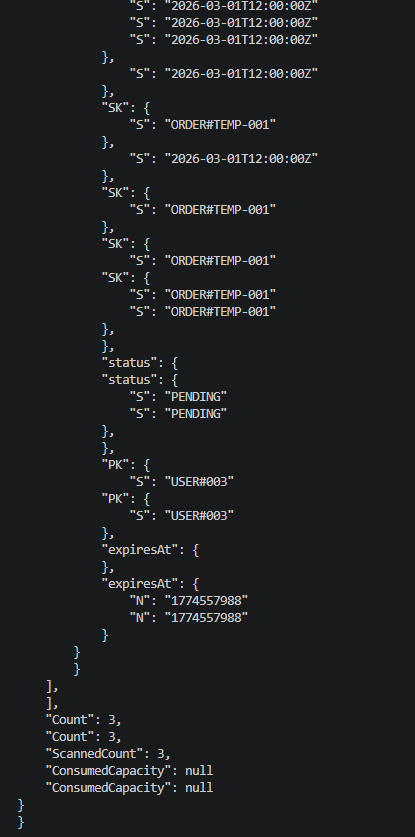
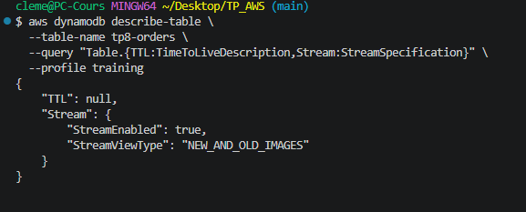
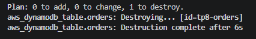

# TP 8 : DynamoDB — Modélisation, GSI, TTL et Streams
 
## Objectif
 
Concevoir et déployer une table DynamoDB orientée requêtes pour un système de commandes e-commerce.
Démontrer la modélisation single-table avec clés composites, l'usage d'un Global Secondary Index, le Time To Live et les Streams.
 
## Infrastructure as Code — Terraform
 
Ce TP a été entièrement réalisé avec **Terraform**. L'ensemble des fichiers sont disponibles dans ce dépôt.
 
### Structure des fichiers
 
| Fichier | Rôle |
|---|---|
| `versions.tf` | Déclaration du provider AWS, région lue depuis le state de `base/` |
| `main.tf` | Table DynamoDB avec GSI, TTL et Streams |
| `outputs.tf` | Output du nom et de l'ARN de la table |
 
> **Note :** Aucune donnée sensible — pas de `variables.tf` ni `terraform.tfvars` pour ce TP.
 
## Modélisation des clés
 
L'objectif de la modélisation est de répondre à toutes les requêtes sans jamais effectuer de Scan (opération coûteuse qui lit toute la table).
 
| Requête cible | Clé utilisée |
|---|---|
| Toutes les commandes d'un utilisateur | PK = `USER#<userId>` (table principale) |
| Trier les commandes d'un utilisateur par date | SK = `ORDER#<orderId>` (tri lexicographique) |
| Toutes les commandes d'un statut donné | GSI `StatusIndex` : PK = `status`, SK = `createdAt` |
 
## Ressources créées
 
### 1. Table DynamoDB (`tp8-orders`)
- Mode de facturation : **PAY_PER_REQUEST** — aucune capacité provisionnée, pas de coût fixe
- Clé de partition (PK) : `USER#<userId>` — type `String`
- Clé de tri (SK) : `ORDER#<orderId>` — type `String`
 
### 2. Global Secondary Index (`StatusIndex`)
- PK : `status` — permet de requêter par statut (`PENDING`, `SHIPPED`, `DELIVERED`)
- SK : `createdAt` — permet de trier les résultats chronologiquement
- Projection : `ALL` — tous les attributs sont disponibles dans les résultats
 
### 3. TTL (`expiresAt`)
- Attribut de type `Number` contenant un timestamp Unix
- DynamoDB supprime automatiquement les items dont `expiresAt` est dépassé
- Utile pour les items éphémères (sessions, paniers temporaires, tokens)
 
### 4. Streams (`NEW_AND_OLD_IMAGES`)
- Capture chaque modification (création, mise à jour, suppression) dans un flux ordonné
- Mode `NEW_AND_OLD_IMAGES` : conserve l'état avant et après chaque opération
- Utilisable pour déclencher une Lambda à chaque changement (pattern event-driven)
 
## Insertion des items de test
 
5 items insérés pour couvrir plusieurs utilisateurs, statuts et le cas TTL.
Les commandes ont été exécutées depuis Git Bash pour bénéficier de la syntaxe JSON en guillemets simples :
 

 
| Item | PK | SK | Statut | Particularité |
|---|---|---|---|---|
| ORDER#2026-001 | USER#001 | ORDER#2026-001 | PENDING | — |
| ORDER#2026-002 | USER#001 | ORDER#2026-002 | SHIPPED | — |
| ORDER#2026-003 | USER#002 | ORDER#2026-003 | PENDING | — |
| ORDER#2026-004 | USER#002 | ORDER#2026-004 | DELIVERED | — |
| ORDER#TEMP-001 | USER#003 | ORDER#TEMP-001 | PENDING | TTL activé (expire +1h) |
 
## Tests de validation
 
### Query 1 — Toutes les commandes de USER#001 (table principale)
 
```bash
aws dynamodb query \
  --table-name tp8-orders \
  --key-condition-expression "PK = :pk" \
  --expression-attribute-values '{":pk":{"S":"USER#001"}}' \
  --profile training
```
 
Retourne les 2 commandes de `USER#001` (`ORDER#2026-001` et `ORDER#2026-002`) sans aucun Scan :
 

 
### Query 2 — Toutes les commandes avec statut PENDING (via GSI)
 
```bash
aws dynamodb query \
  --table-name tp8-orders \
  --index-name StatusIndex \
  --key-condition-expression "#s = :status" \
  --expression-attribute-names '{"#s":"status"}' \
  --expression-attribute-values '{":status":{"S":"PENDING"}}' \
  --profile training
```
 
> **Note :** L'alias `#s` est nécessaire car `status` est un mot réservé DynamoDB.
 
Retourne les 3 commandes en statut `PENDING` issues de 3 utilisateurs différents (`USER#001`, `USER#002`, `USER#003`) :
 



 
### Query 3 — Vérification TTL et Streams
 
```bash
aws dynamodb describe-table \
  --table-name tp8-orders \
  --query "Table.{TTL:TimeToLiveDescription,Stream:StreamSpecification}" \
  --profile training
```
 
- **TTL** : `null` dans la réponse `describe-table` — comportement normal, AWS gère le TTL en arrière-plan indépendamment du schéma de la table. L'attribut `expiresAt` est bien présent sur l'item concerné.
- **Streams** : `StreamEnabled: true`, `StreamViewType: NEW_AND_OLD_IMAGES` — confirmé actif
 

 
## Contrôles de conception appliqués
 
- **Jamais de Scan** — toutes les requêtes utilisent `Query` avec une clé de partition explicite
- Modélisation **single-table** : tous les types d'entités dans une seule table, discriminés par le préfixe de clé (`USER#`, `ORDER#`)
- GSI `StatusIndex` évite un Scan full-table pour les requêtes par statut
- TTL configuré pour la suppression automatique des items éphémères — maîtrise des coûts de stockage
- Streams activés en `NEW_AND_OLD_IMAGES` pour permettre un traitement event-driven ultérieur
- Facturation **PAY_PER_REQUEST** — aucun coût fixe, adapté à un contexte de lab
- Tags obligatoires appliqués sur la table (`Project`, `Owner`, `Env`, `CostCenter`)
 
## Teardown
 
```bash
terraform destroy -auto-approve
```

