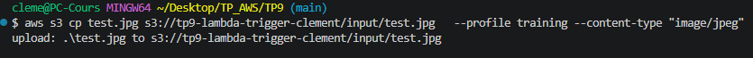
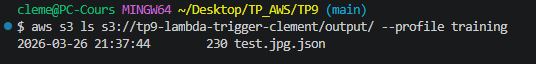
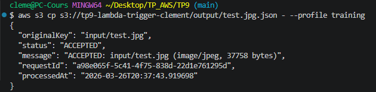
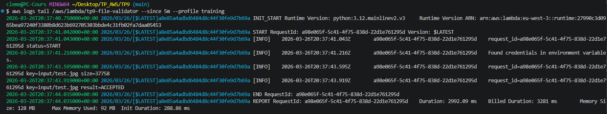
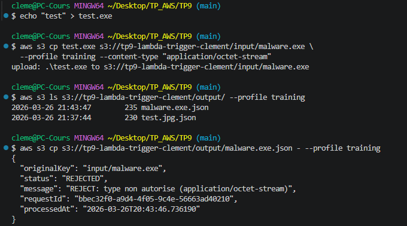

# TP 9 : Lambda trigger S3 — Validation de fichiers, rôles minimaux, logs
 
## Objectif
 
Déployer une fonction Lambda déclenchée automatiquement par un upload S3.
La Lambda valide chaque fichier déposé dans le préfixe `input/` (type MIME et taille), puis écrit un rapport JSON dans `output/`.
Démontrer le principe du moindre privilège sur le rôle IAM et la traçabilité via CloudWatch Logs.
 
## Infrastructure as Code — Terraform
 
Ce TP a été entièrement réalisé avec **Terraform**. L'ensemble des fichiers sont disponibles dans ce dépôt.
 
### Structure des fichiers
 
| Fichier | Rôle |
|---|---|
| `versions.tf` | Déclaration du provider AWS, région lue depuis le state de `base/` |
| `main.tf` | Bucket S3, rôle IAM, fonction Lambda, notification S3 et log group |
| `outputs.tf` | Output du nom du bucket et de l'ARN de la fonction |
| `lambda.py` | Code de la fonction Lambda (Python 3.12) |
 
> **Note :** Aucune donnée sensible — pas de `variables.tf` ni `terraform.tfvars` pour ce TP.
 
## Ressources créées
 
### 1. Bucket S3 (`tp9-lambda-trigger-clement`)
- Blocage public activé sur les 4 paramètres
- Versioning activé
- Chiffrement au repos AES-256
- `force_destroy = true` — permet le teardown même avec des versions d'objets présentes
- Notification configurée sur le préfixe `input/` → déclenche la Lambda sur tout `s3:ObjectCreated:*`
 
### 2. Rôle IAM Lambda (principe du moindre privilège)
Le rôle est strictement limité aux actions nécessaires :
 
| Permission | Scope | Justification |
|---|---|---|
| `s3:GetObject` | `input/*` uniquement | Lecture des fichiers à valider |
| `s3:PutObject` | `output/*` uniquement | Écriture des rapports JSON |
| `logs:CreateLogGroup/Stream`, `logs:PutLogEvents` | Log group dédié | Via `AWSLambdaBasicExecutionRole` |
 
Toute autre action S3 (suppression, listage, accès hors préfixe) est implicitement refusée.
 
### 3. Fonction Lambda (`tp9-file-validator`)
- Runtime : **Python 3.12**, mémoire 128 Mo, timeout 30s
- Déclencheur : notification S3 sur `input/`
- Logique de validation :
  - **Taille** : rejet si > `MAX_SIZE_MB` (5 Mo)
  - **Type MIME** : rejet si `Content-Type` absent de `ALLOWED_TYPES` (`image/jpeg`, `image/png`, `application/pdf`)
- Résultat écrit dans `output/<nom_fichier>.json` avec statut, message, `requestId` et timestamp
- Les logs suivent un format structuré `clé=valeur` — aucune donnée sensible n'est exposée dans CloudWatch
 
### 4. Log Group CloudWatch (`/aws/lambda/tp9-file-validator`)
- Rétention : **7 jours**
- Créé explicitement par Terraform pour maîtriser la durée de rétention (sinon AWS crée un log group sans expiration)
 
## Tests de validation
 
### Cas nominal — fichier JPEG valide
 
Upload d'un fichier `test.jpg` dans le préfixe `input/` :
 

 
La Lambda se déclenche automatiquement. Le rapport apparaît dans `output/` :
 

 
Lecture du rapport JSON généré par la Lambda :
 

 
```json
{
  "originalKey": "input/test.jpg",
  "status": "ACCEPTED",
  "message": "ACCEPTED: input/test.jpg (image/jpeg, 37758 bytes)",
  "requestId": "a98e065f-5c41-4f75-838d-22d1e761295d",
  "processedAt": "2026-03-26T20:37:43.919698"
}
```
 
### Logs CloudWatch — traçabilité de l'exécution
 
```bash
MSYS_NO_PATHCONV=1 aws logs tail /aws/lambda/tp9-file-validator \
  --since 5m --profile training
```
 
Les logs confirment le cycle complet : `status=START` → clé et taille détectées → `result=ACCEPTED` → durée et mémoire utilisée :
 

 
### Cas rejeté — type MIME non autorisé
 
Upload d'un fichier `.exe` avec `Content-Type: application/octet-stream` :
 
```bash
echo "test" > test.exe
aws s3 cp test.exe s3://tp9-lambda-trigger-clement/input/malware.exe \
  --profile training --content-type "application/octet-stream"
```
 
Le listing de `output/` montre les deux rapports générés (`test.jpg.json` et `malware.exe.json`).
Le rapport du fichier rejeté indique le statut `REJECTED` et la raison `type non autorise` :
 

 
```json
{
  "originalKey": "input/malware.exe",
  "status": "REJECTED",
  "message": "REJECT: type non autorise (application/octet-stream)",
  "requestId": "bbec32f0-a9d4-4f05-9c4e-56663ad40210",
  "processedAt": "2026-03-26T20:43:46.736190"
}
```
 
## Contrôles sécurité appliqués
 
- Bucket entièrement privé — blocage public sur les 4 paramètres
- Rôle IAM **strictement minimal** : lecture `input/` et écriture `output/` uniquement
- Trigger S3 limité au préfixe `input/` — les fichiers dans `output/` ne redéclenchent pas la Lambda
- Logs structurés — aucune donnée sensible exposée dans CloudWatch
- Chiffrement AES-256 au repos sur tous les objets
- Versioning activé — restauration possible de n'importe quel état antérieur
- Tags obligatoires appliqués (`Project`, `Owner`, `Env`, `CostCenter`)
 
## Teardown
 
```bash
aws s3 rm s3://tp9-lambda-trigger-clement --recursive --profile training
terraform destroy -auto-approve
```
 
J'ai cependant renonctré une erreur lors du terraform destroy car le bucket n'était pas vide à cause du versioning : les objets "supprimés" laissent des delete markers — aws s3 rm --recursive ne les efface pas.
J'ai donc dû les supprimer : 
```bash
# Supprimer toutes les versions et delete markers
aws s3api delete-objects \
  --bucket tp9-lambda-trigger-clement \
  --delete "$(aws s3api list-object-versions \
    --bucket tp9-lambda-trigger-clement \
    --query '{Objects: Versions[].{Key:Key,VersionId:VersionId}}' \
    --output json \
    --profile training)" \
  --profile training

# Supprimer les delete markers
aws s3api delete-objects \
  --bucket tp9-lambda-trigger-clement \
  --delete "$(aws s3api list-object-versions \
    --bucket tp9-lambda-trigger-clement \
    --query '{Objects: DeleteMarkers[].{Key:Key,VersionId:VersionId}}' \
    --output json \
    --profile training)" \
  --profile training

# Puis relancer le destroy
terraform destroy -auto-approve
```
En ajoutant `force_destroy = true`, Terraform peut vider et supprimer le bucket automatiquement, y compris toutes les versions d'objets
